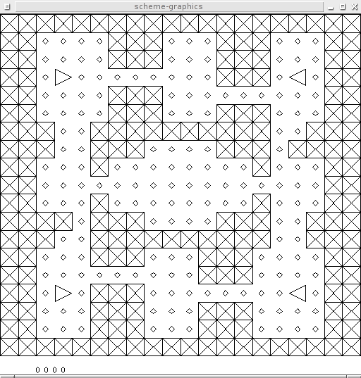

Mouser Programming Contest
==========================

This is the source archive for a programming contest we ran at
Zhejiang University taking a Scheme course we taught there. In the
contest, students write Scheme programs to control robots which can
collect dots and shoot at each other. I wrote most or all of the code
for the contest, but the course was a joint project with three other
MIT students. This is all based on MIT Scheme.

The contest was extremely successful. Zhejiang University has very
sharp students.

1.  Contest overview
--------------------

In this programming contest, there is a game map with 2 players on it,
each controlling some number of robots:

    XXXXXXXXXXXXXXXXXXXX
    XX....XXX...XXX...XX
    XX....XXX...XXX...XX
    XX.>........XXX.<.XX
    XX....XXX.........XX
    XX....XXX...XXX...XX
    XXX..XXXXXXXXXX..XXX
    XXX..XXX....XXX.XXXX
    XX...X........X...XX
    XX................XX
    XX...X........X...XX
    XXXX.XXX....XXX..XXX
    XXX..XXXXXXXXXX..XXX
    XX...XXX...XXX....XX
    XX.........XXX....XX
    XX.>.XXX........<.XX
    XX...XXX...XXX....XX
    XX...XXX...XXX....XX
    XXXXXXXXXXXXXXXXXXXX

Sample map with a total of 4 robots (2 per player). Top 2 players
belong to one player, bottom two to the other.

The initial map consists of walls (marked with 'X'), and points
(marked with '.'). As gameplay proceeds, it will also have empty tiles
(marked with ' '). The goal is to collect more points than the
opposing player.

To collect points, one must simply move their robot over a tile with a
point on it. Up to here, the game is similar to a multiplayer version
of Pacman. In addition, robots may destroy opposing (or even allied)
robots with a laser.

2. Technical details
--------------------
		       
In each round of the contest, the following events take place: 

* All robots over a point gain a point
* All robots move (rotate or forward)
* Lasers fire. All robots in the path-of-fire for a laser are
  destroyed simultaneously.

If a robot tries to move into a wall, into another robot, or two
robots try to move into the same tile, no movement happens. 

If a robot fires a laser, all robots in the line-of-fire of the laser
are destroyed. The line-of-fire includes all squares in front of the
robot up to the first wall (lasers do not pass through walls). 

At the end of every round, all robots are given an updated version of
the map. Each robot must respond with one of four commands:

* `L` - Rotate left
* `R` - Rotate right
* `F` - Move one square forward
* `S` - Shoot laser
* `X` - Skip round

Any other commands will be treated as `X` (skip round). 

2.1 Scheme libraries provided
-------------

To load the game framework: 

    (load "framework.scm")

To initialize a game:

    (define game (mouser-init))

To deinitialize a game: 

    (deinit game)

3. Contest details
-----------

The contest will consist of double elimination. 

Moves will be timestamped. A player who takes more than 1 second to
process a move may be disqualified, at the discretion of the contest
organizers (we will do this if a round is taking unreasonably long).

4. Team selection
-----------

Teams may be composed of 1-4 people, but we recommend selecting a team
size of 2 or 3 people. You may select your own teammates. If you don't
know people in the class (or for other reasons, cannot choose
teammates), speak to us, and we will try to partner you with other
people in the class.

5. Suggestions
-----------

Begin small, and develop the system further from a working
prototype. Once that is working, add features. A suggested development
strategy:

* Take a random move each turn
* Modify to always move forward if there is a ball in front of you
  (otherwise, move randomly)
* Add shooting functionality -- if there is a robot in the path of the
  laser, shoot it.
* Rotate towards ball if no ball in front of you
* Find path to nearest ball if there is no ball in the 4 squares
  around you
* Add dodging functionality -- do not move into the path of a laser
* Add better dodging functionality -- do not move into the possible 
  path of a laser
* Add better shooting functionality -- try to explicitly rotate or
  move to where you can shoot other robots
* Search for an optimal path to get points
* Add coordination between robots
* ...

In other words, do not try to find a near-optimal global solution and
implement it. Begin with a small, working system, and try to grow it
into a more advanced system. 

As you are building your system, try to learn to use the available
on-line resources. In particular, the MIT/Scheme manual gives useful
information on the libraries provided with Scheme. Making good use of
these libraries will dramatically shorten development time. In
addition, SICP, the 6.001 textbook, is also available on-line, and may
be a useful reference. 

6. Background information
-----------

Students at MIT hold a number of programming competitions. The most
popular three are held during the Independent Activities Period in
January:

* 6.370 is a Java programming competition, in which students write
  computer programs to compete in a game. This is very similar to the
  competition we are running for you, only the games (and solutions)
  are considerably more complex (since it is a month-long
  competition).
* 6.270 is a competition in which students build robots out of Lego
  blocks to compete in a competition (e.g. trying to get as many balls
  in a bin). The robots are autonomous, and probably the bulk of the
  work is in programming the robots (rather than in constructing
  them).
* MASLab is a competition in which students also build robots, but the
  competition is more open-ended -- students can use any building
  materials, rather than just Legos, and the students do not know the
  exact layout of the playing field beforehand. The bulk of the work
  is programming the robots to be autonomous.

All of these competitions are organized and run entirely by
students. Students learn tremendous amounts by participating, and
organizers learn a tremendous amount by developing the contests. In
the case of 6.370, students only learn programming, but in 6.270, and
especially MASLab, students from different disciplines will work
together on teams, and will learn from each other across disciplines.

Mouser is designed as a small demonstration of this sort of
programming competition.

The idea behind many of the details of the game came from a very
similar one-day competition run by Trilogy (as a recruiting event).

At MIT, although the contest often have substantial prizes, they are
at least as cooperative as they are competitive. Teams will generally
try to help each other (e.g. in the case of bug in the contest, or
otherwise). We would like to encourage teams here to also cooperate,
share knowledge, and try to help each other succeed. While the direct
goal of participating in the contest is to win, the overall goal is to
learn, and to gain practice working on a substantial piece of code
under deadline.

Downloads 
-----------

* Archives of the source are available in the `archive`
  directory. Otherwise, `git clone`. Requires `gcc` for the server and
  `MIT-Scheme` for the client. The client has only been tested under
  GNU/Linux. The Windows version of MIT-Scheme will almost certainly
  require minor changes to the graphics code to function.
* A presentation on the contest is in the `docs` directory
* The staff robot just made random moves. I can't remember which of
  these three files it was in: (`testbot.scm`, `piotrs-bot.scm`, or
  `testbot-graphical.scm`.

License
-------

This program is free software; you can redistribute it and/or modify
it under the terms of the GNU General Public License as published by
the Free Software Foundation; either version 2 of the License, or
(at your option) any later version.

This program is distributed in the hope that it will be useful,
but WITHOUT ANY WARRANTY; without even the implied warranty of
MERCHANTABILITY or FITNESS FOR A PARTICULAR PURPOSE.  See the
GNU General Public License for more details.

You should have received a copy of the GNU General Public License along
with this program; if not, write to the Free Software Foundation, Inc.,
51 Franklin Street, Fifth Floor, Boston, MA 02110-1301 USA.
